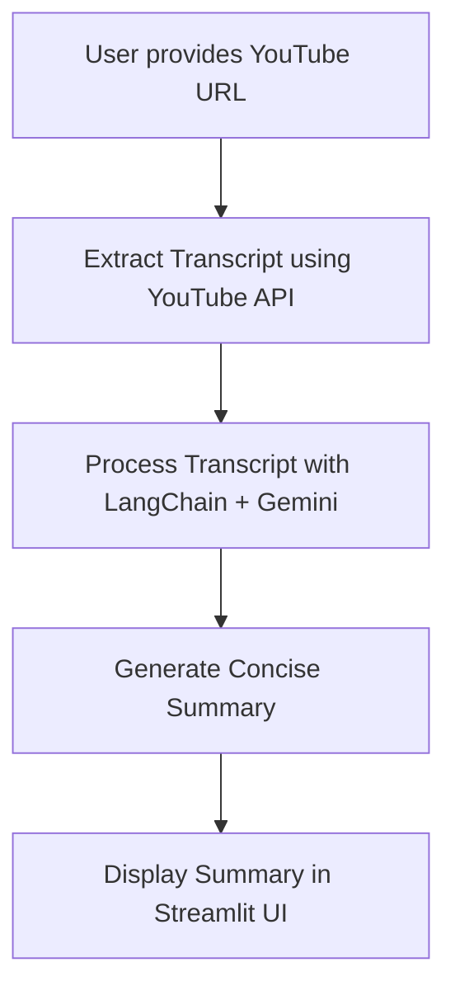
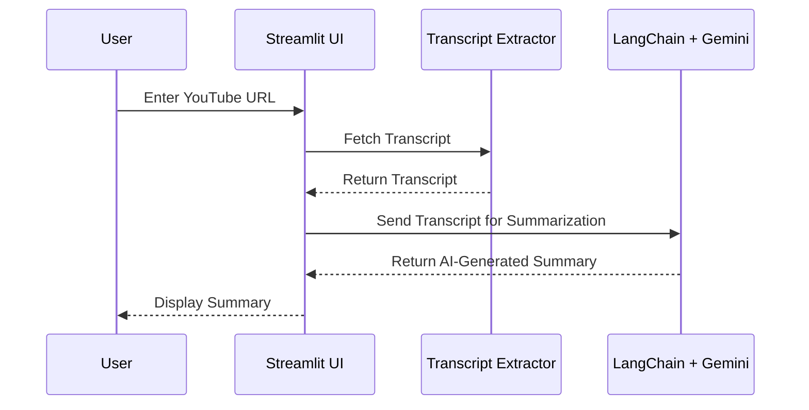

 # 🎥 YT-Video-Summarizer

A **Generative AI-powered YouTube Video Summarizer** built with **LangChain**, **Google Gemini**, and **Streamlit**.  
This tool allows users to **paste a YouTube video URL** and instantly generate an **AI-driven summary** of its transcript.  

---

## 📌 Table of Contents
- [Features](#features)  
- [Tech Stack](#tech-stack)  
- [Architecture](#architecture)  
- [Workflow](#workflow)  
- [Screenshots](#screenshots)  
- [Getting Started](#getting-started)  
  - [Prerequisites](#prerequisites)  
  - [Installation](#installation)  
  - [Configuration](#configuration)  
  - [Usage](#usage)  
- [Project Structure](#project-structure)  
- [Contributing](#contributing)  
- [License](#license)  
- [Contact](#contact)  

---

## 🚀 Features
- 🎬 **Summarize YouTube videos** using just the URL  
- 🧠 **LLM-powered** summarization via **LangChain** and **Google Gemini**  
- 📜 **Transcript extraction** and context-aware analysis  
- 🖥️ **Streamlit UI** for user-friendly interaction  
- ⚡ **Fast and scalable** with prompt optimization  

---

## 🛠️ Tech Stack
- **Language**: Python  
- **Frameworks**: LangChain, Streamlit  
- **LLM**: Google Gemini  
- **Libraries**: YouTube Transcript API, Transformers  
- **Deployment**: Streamlit App  

---

## 🏗️ Architecture
1. User enters a **YouTube video URL**.  
2. The app fetches the **transcript** of the video.  
3. LangChain + Gemini processes the transcript.  
4. An **AI-generated summary** is returned and displayed.  

---

## 🔄 Workflow

### Flowchart

---

---
📸 Screenshots


---
---

## ⚡ Getting Started

### ✅ Prerequisites
- Python **3.8+**
- [Google Gemini API Key](https://ai.google.dev/)
- [Streamlit](https://streamlit.io/)

### 📥 Installation
Clone the repository and install dependencies:

```bash
git clone https://github.com/Atharv-M/YT-Video-Summarizer.git
cd YT-Video-Summarizer
pip install -r requirements.txt
```


### ⚙️ Configuration

1. Create a `.env` file in the root directory.
2. Add your Gemini API key inside it:


```
GEMINI_API_KEY=your_api_key_here
```

### ▶️ Usage

Run the Streamlit app with:

```bash
streamlit run app.py
```

Now open the app in your browser, paste a **YouTube video URL**, and get the **AI-generated summary** 🎉

👨‍💻 Contact

Author: Atharv M
GitHub: Atharv-M
